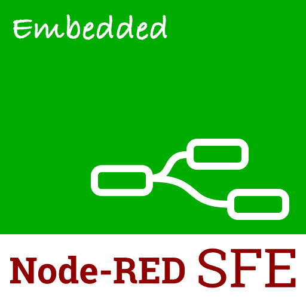
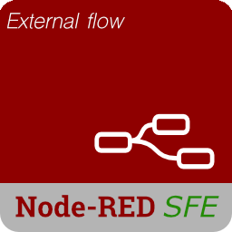

# Node-RED SFE

A Single File Executable toolkit for Node-RED.

## Precursor

Node-RED is an insanely capable Visual Automation and Data Processing platform built around Node JS.
It's been used in the following environments:

 - Home IoT Automation
 - Data Processing
 - Enterprize Business Automation
 - Plant & Manufacturing Automation
 - Bespoke Application Design
 - Fun

 And so much more.

 It is typically installed on a server:

  - Raspberry Pi
  - Windows Servers
  - Linux Servers
  - Virtual Machines

  And many more SBC's

  ## The Problem

  The simplicity of Node-RED means it's been used as a core piece of the puzzle in application design, say to automate actions, process data, and so on and so forth.
  
  This presents a few problems/hurdles:

  As Node-RED is based on Node JS, the code for an application, automation, or process is easily viewed and can be messed with, let alone exposing IP, which should not be made easily accessible.

  Example: You're tasked by your client to design a dashboard that takes input from a user, and it gets processed with your magic sauce/IP. There will be some level of code (or all of it), that you don't want to reveal or be messed with.

  While Node-RED can require authentication to access the Editor, gaining access to the code/flow data requires very little effort.

  There are other hurdles at play, such as the requirement to have Node JS installed.

  ## Introducing Node-RED SFE

  Node-RED SFE is a toolkit that brings a solution to the aforementioned hurdles.
  It is a system that can package up your Node-RED project into a Single File Executable.

   - One Executable File
   - No need to install Node JS on the target server
   - Your Code/IP is not easily accessed
   - Portable Application

   Using API's from https://esbuild.github.io and https://github.com/yao-pkg/pkg

   This toolkit allows you to design a flow, an application, a dashboard, or whatever you like. ESBulds it all and outputs a Single File Executable
   that starts up your flow as if it were a compiled/native application, without the need for Node JS to be installed.

   This results in the code/flow data not being easily accessible, and the ability to 'modify' or 'play' with the end result is severely inhibited.

## Sold! Sold! Sold!
So let's get started.

Node-RED SFE currently uses Node-RED 4.

 - Clone this repo
 - Issue `npm install`
 - Issue `npm run-script develop`

 You're now in 'Design Time'

 - Install Extra Nodes
 - Create Your Flows
 - Deploy
 - ect etc 

 Once you're happy, terminate Node-RED SFE

 - Issue `npm run-script build`
 - Issue `npm run-script package`

 You will now have an SFE in `./build/dist` - Congraulations!

 ## Configuration

 Node-RED employs a configuration for itself, and this can be found in `settings.js`

 ```js
/* Node-RED Settings
 *
 * Note: The following properties/objects will be ignored as they are integral to the running of Node-RED SFE
 *  - userDir
 *  - logging
 *  - functionGlobalContext
 *  - editorTheme
 *  - readOnly
 */

module.exports = {
	uiPort: 1880,
	flowFile: 'flows.json',
	flowFilePretty: true,
	httpAdminRoot: '/',
	httpNodeRoot: '/',

	/* Change me */
	credentialSecret: '#########################',

	/* This should be set to true, JUST BEFORE compiling to an SFE */
	/* But it will be ignored (forcibly set to false) during the development stage */
	disableEditor: false,

	/* Vital! IF NOT disabling the editor */
	/* Default: admin:admin */
	adminAuth: {
		type: 'credentials',
		users: [
			{
				username: 'admin',
				password: '$2a$12$J0TtWc6Newz3DuC1nbScoee1jXS/hSuHQ2KeMRRD58Wxp7ZNk6uo6',
				permissions: '*'
			}
		]
	}
};
 ```

 There are a few important things to change here.

  - `credentialSecret` - The encryption key for credentials that might be used in your flow
  - `disableEditor` - If the editor should be disabled in the final output executable
  - And of course, the credentials for the editor, if you choose to keep them active

  You are free to add anything in here that is supported by Node-RED, but pay attention to the stuff that is overwritten.

 ## ReadOnly File System.

The final executable will contain an embedded file system, which is read only.
Therefore, if you do not block access to the Editor (`disableEditor`) and try to deploy (or install Nodes) after, it will fail.

Node-RED SFE can actually operate in two ways:

 - With an Embedded flow (the main use case)
 - A standard Node-RED portable application

 Both scenarios will output an SFE, so Node JS is still not required in either setup.
 The mode is manipulated based on whether there is a directory called `NRHomeDir`.

 When you run `npm run-script build`, it will check if there is such a directory.
 If there is, it will package it up and cause it to "lock" to the developed/embedded flow.

 If the editor is left accessible, the mode is identified by the login image, as well as certain actions being disabled that won't be supported in a ReadOnly file system.

 
 

`npm run-script develop` basically just starts Node-RED and sets the `userDir` to this folder.
 `NRHomeDir` is no different from the `.node-red` directory.

 If a flow is not embedded, the SFE will create a directory called `NRHomeDir` on startup if it's not already been created.
 This allows you to deploy the executable with a modifiable flow (but note: this also allows you to view the flow code)

 For a typical use case, you will:

  - `npm run-script develop`
  - Design your application
  - Set `disableEditor` to true
  - `npm run-script build`
  - `npm run-script package`
  - Distribute the SFE

  How you use this toolkit is entirely up to you.

 ## Context Stores.

 There are 2 configured context stores.

  - `memory` (default)
  - `file`

  The file context store, is configured to use the directory the executable is run from, if a flow is embedded


 ## Application Logging.

 The SFE adds a global logging function to Node-RED to allow debug logs to be created.

 ```js
 const Log = global.get('SFELOG');
 Log('info','My Application','Hello, World')
 ```

 This is a daily rotated log file.
 The log file is named `sfe-%DATE%.log` with a 7-day retention policy.

 The date format is **YYYY-MM-DD-HH**

 These log entries are also printed at the console but are identified as `FLOW:Label`
 Example:

 ```
 /* Console */
 [2024-07-14 03:29:53] info     FLOW:My Application    : Hello, World

 /* Log File */
 [2024-07-14 03:29:53] info     My Application    : Hello, World
 ```  

 **Note**: The log file only gets created after it's been compiled to an SFE regardless of mode.
